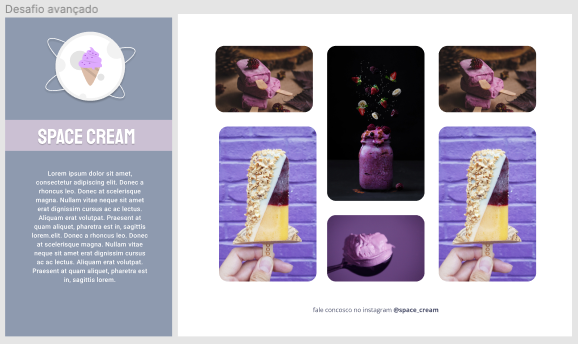
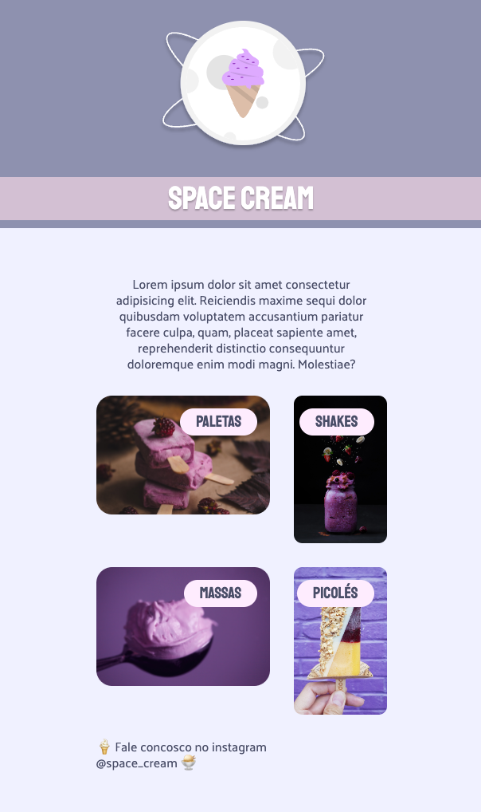
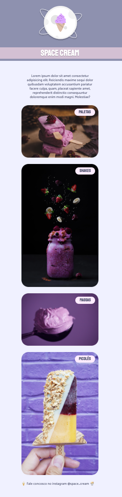

# 🍦 Página em formato mobile com animações
🍨 _Page in mobile format with animations_

# 👩🏼‍🚀 Objetivo:
_Objective:_

🇧🇷 Neste projeto foram apresentadas funcionalidades como: animações simples de imagens e textos, uso de variáveis e unidades de medida flexíveis.

🇺🇸 _In this project, functionalities such as: simple animations of images and texts, use of variables and flexible measurement units were presented.._

📸   
 Captura de tela Figma:
 
 _Figma Screenshot:_

# 🪄 Techonogias:
_Technology:_

- [HTML](../index.html)
- [CSS](../css.html)
- [Figma](https://www.figma.com/file/YIwVKGWUbkqe8p93g09wo7/Stage-03---Grid-com-anima%C3%A7%C3%B5es-(Copy)?node-id=0-1&t=5b1iAU6UPKPCu94U-0)
- [Git & Github](https://github.com/BiancaMos)

#
# 👩🏻‍💻 Responsividade em alguns dispositivos diferentes: 
 
_Responsiveness on a few different devices:_  

📸 Screenshots: Desktop and mobile:

#
## 🛰 Projeto:
 _Project:_

🇧🇷 Foi desenvolvido com base nas aulas da Turma 09 Explorer Rocketseat.  

🇺🇸 _Made in Rocketseat's course Explorer._
#
### 🗓 Abril de 2023
 _April 2023_ 
#
 ### 🔗 Link: 
 🇧🇷 [Projeto online aqui!](http://127.0.0.1:5500/index.html)
   
 🇺🇸 [_Project online here!_](http://127.0.0.1:5500/index.html)

 #
                    Feito com 💜 by BM